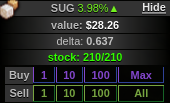
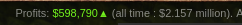
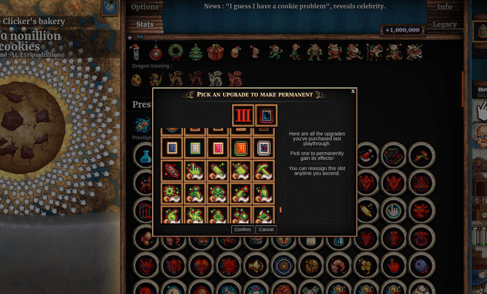
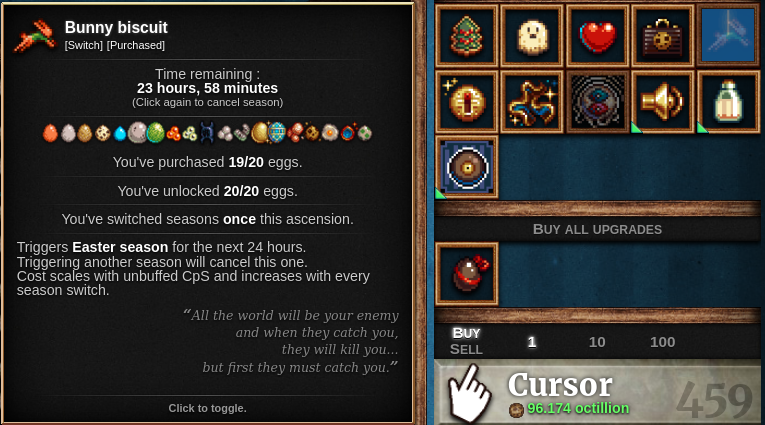
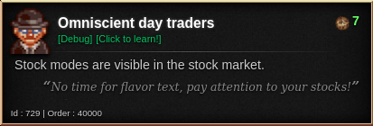

Spiced Cookies
==============

Adds a little bit of spice to your Cookie Clicker gameplay.

This is a collection of small modifications to the game Cookie Clicker.
Every single feature can be either ignored or disabled in the settings,
and most of them start disabled by default.

All the features are listed below.


Using the mod
=============

**NOTE:** this mod is still in its alpha phase,
so there will be bugs and crashes.
**Backup your save**.

The best solution is adding
<https://staticvariablejames.github.io/SpicedCookies/Spice.js>
to [Cookie Clicker Mod Manager](https://github.com/klattmose/CookieClickerModManager).

Alternatively,
run
```javascript
    Game.LoadMod('https://staticvariablejames.github.io/SpicedCookies/Spice.js');
```
on your browser Javascript console,
or create a bookmarklet with the code
```javascript
    javascript:(function(){Game.LoadMod('https://staticvariablejames.github.io/SpicedCookies/Spice.js');}());
```


Features
========

Save the history of stock market prices (enabled by default)
------------------------------------------------------------

Vanilla Cookie Clicker only saves the current price of the stock in the save file.
This mod saves the entire history for all stocks,
up to 65 data points
(which is enough to fill the minigame's diagram).


Display the delta of stock market goods (enabled by default)
------------------------------------------------------------



Despite saving the current price for stock market goods,
vanilla Cookie Clicker displays two values when loading a save file.
The first value is actually the current price minus the delta
instead of the previous value;
so actually the delta _is_ available for players,
just not in a straightforward way.
This mod shows the delta below the value of each stock.


Track more statistics across ascensions (non-disableable)
---------------------------------------------------------



This mod records five statistics across all ascensions
which the vanilla game only records for a single ascension:
- Cookie clicks
- Hand-made cookies
- Wrinklers popped
- Reindeer found
- Stock market profits

The latter is displayed directly on the stock market minigame!


Merciful Market Profit Tallying (enabled by default)
----------------------------------------------------

Of the five statistics which are now tracked,
the stock market profits is the only one of them that can go negative,
so it would be the only statistic in which progress can be undone.
To prevent this,
by default,
the mod only adds the stock market profits to the across-ascensions tally
if the profits are positive.


Across-ascensions progress unlocks achievements (enabled by default)
--------------------------------------------------------------------

Achievements for popping wrinklers,
clicking reindeer,
baking cookies by hand,
and Liquid and Gaseous Assets
are awarded based on the all-time progress,
rather than based only on the progress in the current ascension.

Note that the upgrades unlocked by baking cookies by hand
still require cookies baked in a single ascension to be unlocked.


Two extra achievements for popping wrinklers and clicking reindeer (disabled by default)
----------------------------------------------------------------------------------------

Adds one achievement for bursting 1000 wrinklers
and another for popping 1000 reindeer.
These are regular achievements that give milk (if they are enabled).

These achievements are awarded according to progress through all ascensions
regardless of the previous setting.

Note: if you disable this feature after having enabled it once,
you must refresh your browser for the change to take place.


Three extra stock market achievements (disabled by default)
-----------------------------------------------------------

Adds three stock market achievements:
one for getting $1 million in profits a single ascension,
one for having -$1 million in profits and no goods in stock in a single ascension,
and a shadow one for getting to -$31.536 million in profits in a single ascension.

The first two achievements do give milk.

Note: if you disable this feature after having enabled it once,
you must refresh your browser for the change to take place.


Numerically stable formula for heavenly chip gains (disabled by default)
------------------------------------------------------------------------

Because Javascript numbers are all floating-point,
prestige levels can only be gained in increments of `p/2^52`,
where `p` is the current prestige level.
This is harmless in the beginning of the game,
but as soon as `p` becomes larger than `2^53` (about 9 quadrillion)
achievements like Endless Cycle become significantly harder,
because instead of getting a single prestige level
now we need to get `p/2^52` prestige levels
before being able to ascend and have that run count towards the achievement.

This mod adds a numerically stable formula for computing the new prestige level,
so that the achievements like Endless Cycle are less painful to get at high prestige levels.

Due to truncation the stable approximate formula may actually be off by one prestige level,
but the computed value always underestimates the theoretical number
(so the mod never makes it easier to get the achievements).
To prevent issues with low prestige values,
if the number given by the vanilla formula would be higher,
then that number is used instead.


Permanent upgrade slots can be chosen during an ascension (non-disableable)
---------------------------------------------------------------------------

During an ascension,
you can click on the permanent upgrade slots in the statistics menu
to change the permanent upgrades for the next ascension.



(It takes a few seconds for the displayed picture to change in the statistics page.)


Season switcher tooltips says how many seasonal upgrades were unlocked (non-disableable)
----------------------------------------------------------------------------------------



The season switches now have a line saying how many upgrades from that season were unlocked.
This is useful, for example, if you are saving Chocolate egg for a combo.

By default,
this extra line is hidden if all upgrades were bought.
This can be disabled in the menu.


Display the mode of stock market goods (debug upgrade)
------------------------------------------------------



Adds a debug upgrade that displays the current mode of a stock,
in a similar manner that the deltas are displayed.
For example,
in the picture above,
Sugar is in slow rise,
and it will stay this way for the next 716 ticks.

To get the upgrade,
you need to either Open Sesame,
or type the following command in the console:
```javascript
    Game.Upgrades['Omniscient day traders'].toggle();
```


Preserve debug upgrades across ascensions (debug upgrade)
---------------------------------------------------------


Debug upgrades are mere upgrades,
so they get wiped out after ascending.
This debug upgrade allows you to keep them
(like a persistent upgrade slot,
but for debug upgrades only,
and affecting all debug upgrades).

This is particularly useful with "Perfect idling" and "Omniscient day traders",
which are upgrades players might want to have throughout an entire game.

To get the upgrade,
you need to either Open Sesame,
or type the following command in the console:
```javascript
    Game.Upgrades['Transcendent debugging'].toggle();
```


Discrepancy Patch (disabled by default)
---------------------------------------

If a sugar lump is left to be harvested automatically,
the next lump should start growing in the instant that the previous lump is harvested.
However, since Javascript is slow and the game relies on `Date.now()` for this,
sometimes the game misses the mark by a few milliseconds.
[This is relevant for manipulating the sugar lump type](https://github.com/staticvariablejames/ChooseYourOwnLump#a-wrench-in-our-plans).

This patches it so that the growth start is consistent.

This mod can only patch the issue after it is loaded,
so in order to take advantage of it you must reload your save from a backup.

(Always reloading your save from a backup is reccomended anyway
because in the very first time that a save is loaded
the minigames are still loading,
so Rigidel has no effect on lump times.)

Note: if you disable this feature after having enabled it once,
you must refresh your browser for the change to take place.


Changelog
=========

0.1.0
-----

Alpha release,
mostly with just a few features for the stock market.

0.2.0
-----

Adds a numerically stable formula for heavenly chips,
allows changing permanent upgrade slots during an ascension,
and add slightly nicer tooltips for the season switchers.

0.2.1
-----

Update to Cookie Clicker v2.031.

0.2.2
-----

Fix a stock market crash that happens when a pre-idleverses save is loaded.

0.2.3
-----

Fix a ReferenceError related to permanent upgrade slots.

0.2.4
-----

Register the mod in the modding API and use it for storing settings and save game data.
