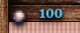
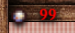
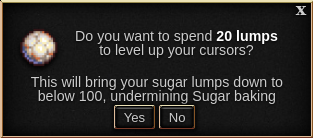
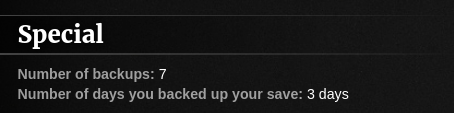
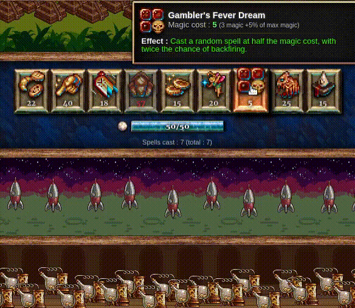

Spiced Cookies
==============

Adds a little bit of spice to your Cookie Clicker gameplay.

This is a collection of small modifications to the game Cookie Clicker.
Every single feature can be either ignored or disabled in the settings,
and most of them start disabled by default.

All the features are listed below.


Using the mod
=============

**NOTE:** this mod is still in its alpha phase,
so there will be bugs and crashes.
**Backup your save**.

The best solution is adding
<https://staticvariablejames.github.io/SpicedCookies/Spice.js>
to [Cookie Clicker Mod Manager](https://github.com/klattmose/CookieClickerModManager).

Alternatively,
run
```javascript
    Game.LoadMod('https://staticvariablejames.github.io/SpicedCookies/Spice.js');
```
on your browser Javascript console,
or create a bookmarklet with the code
```javascript
    javascript:(function(){Game.LoadMod('https://staticvariablejames.github.io/SpicedCookies/Spice.js');}());
```


Features
========

Save the history of stock market prices (enabled by default)
------------------------------------------------------------

Vanilla Cookie Clicker only saves the current price of the stock in the save file.
This mod saves the entire history for all stocks,
up to 65 data points
(which is enough to fill the minigame's diagram).


Display the delta of stock market goods (enabled by default)
------------------------------------------------------------


Despite saving the current price for stock market goods,
vanilla Cookie Clicker displays two values when loading a save file.
The first value is actually the current price minus the delta
instead of the previous value;
so actually the delta _is_ available for players,
just not in a straightforward way.
This mod shows the delta below the value of each stock.


Track more statistics across ascensions (non-disableable)
---------------------------------------------------------


This mod records five statistics across all ascensions
which the vanilla game only records for a single ascension:
- Cookie clicks
- Hand-made cookies
- Wrinklers popped
- Reindeer found
- Stock market profits

The latter is displayed directly on the stock market minigame!


Merciful Market Profit Tallying (enabled by default)
----------------------------------------------------

Of the five statistics which are now tracked,
the stock market profits is the only one of them that can go negative,
so it would be the only statistic in which progress can be undone.
To prevent this,
by default,
the mod only adds the stock market profits to the across-ascensions tally
if the profits are positive.


Across-ascensions progress unlocks achievements (enabled by default)
--------------------------------------------------------------------

Achievements for popping wrinklers,
clicking reindeer,
baking cookies by hand,
and Liquid and Gaseous Assets
are awarded based on the all-time progress,
rather than based only on the progress in the current ascension.

Note that the upgrades unlocked by baking cookies by hand
still require cookies baked in a single ascension to be unlocked.


Two extra achievements for popping wrinklers and clicking reindeer (disabled by default)
----------------------------------------------------------------------------------------

Adds one achievement for bursting 1000 wrinklers
and another for popping 1000 reindeer.
These are regular achievements that give milk (if they are enabled).

These achievements are awarded according to progress through all ascensions
regardless of the previous setting.

**NOTE**: You must refresh your browser page after disabling this feature
for the change to take place.


Three extra stock market achievements (disabled by default)
-----------------------------------------------------------

Adds three stock market achievements:
one for getting $1 million in profits a single ascension,
one for having -$1 million in profits and no goods in stock in a single ascension,
and a shadow one for getting to -$31.536 million in profits in a single ascension.

The first two achievements do give milk.

**NOTE**: You must refresh your browser page after disabling this feature
for the change to take place.


Numerically stable formula for heavenly chip gains (disabled by default)
------------------------------------------------------------------------

Because Javascript numbers are all floating-point,
prestige levels can only be gained in increments of `p/2^52`,
where `p` is the current prestige level.
This is harmless in the beginning of the game,
but as soon as `p` becomes larger than `2^53` (about 9 quadrillion)
achievements like Endless Cycle become significantly harder,
because instead of getting a single prestige level
now we need to get `p/2^52` prestige levels
before being able to ascend and have that run count towards the achievement.

Furthermore, beyond `2^53`,
every number in Javascript is even,
so it is impossible to have a prestige level ending in 7.
This makes it impossible,
for example,
to unlock the upgrade Lucky digit.

This mod adds a numerically stable formula for computing the new prestige level,
so that the achievements like Endless Cycle are less painful to get at high prestige levels.
Combined with the [changes to the unlocking conditions for the 777-series of upgrades](#the-777-series-of-upgrades-are-unlocked-based-on-prestige-gain-disabled-by-default),
this also prevents the player from being permanently unable to acquire those upgrades.

The formula only kicks in at high prestige levels
(beyond 9 quadrillion).

**NOTE**: You must refresh your browser page after disabling this feature
for the change to take place.


Permanent upgrade slots can be chosen during an ascension (non-disableable)
---------------------------------------------------------------------------

During an ascension,
you can click on the permanent upgrade slots in the statistics menu
to change the permanent upgrades for the next ascension.


Season switcher tooltips says how many seasonal upgrades were unlocked (non-disableable)
----------------------------------------------------------------------------------------


The season switches now have a line saying how many upgrades from that season were unlocked.
This is useful, for example, if you are saving Chocolate egg for a combo.

By default,
this extra line is hidden if all upgrades were bought.
This can be disabled in the menu.


Display the mode of stock market goods (debug upgrade)
------------------------------------------------------


Adds a debug upgrade that displays the current mode of a stock,
in a similar manner that the deltas are displayed.
For example,
in the picture above,
Sugar is in slow rise,
and it will stay this way for the next 716 ticks.

To get the upgrade,
you need to either Open Sesame,
or type the following command in the console:
```javascript
    Game.Upgrades['Omniscient day traders'].toggle();
```


Preserve debug upgrades across ascensions (debug upgrade)
---------------------------------------------------------


Debug upgrades are mere upgrades,
so they get wiped out after ascending.
This debug upgrade allows you to keep them
(like a persistent upgrade slot,
but for debug upgrades only,
and affecting all debug upgrades).

This is particularly useful with "Perfect idling" and "Omniscient day traders",
which are upgrades players might want to have throughout an entire game.

To get the upgrade,
you need to either Open Sesame,
or type the following command in the console:
```javascript
    Game.Upgrades['Transcendent debugging'].toggle();
```


Discrepancy Patch (disabled by default)
---------------------------------------

If a sugar lump is left to be harvested automatically,
the next lump should start growing in the instant that the previous lump is harvested.
However, since Javascript is slow and the game relies on `Date.now()` for this,
sometimes the game misses the mark by a few milliseconds.
[This is relevant for manipulating the sugar lump type](https://github.com/staticvariablejames/ChooseYourOwnLump#a-wrench-in-our-plans).

This patches it so that the growth start is consistent.

This mod can only patch the issue after it is loaded,
so in order to take advantage of it you must reload your save from a backup.

(Always reloading your save from a backup is reccomended anyway
because in the very first time that a save is loaded
the minigames are still loading,
so Rigidel has no effect on lump times.)

**NOTE**: You must refresh your browser page after disabling this feature
for the change to take place.


Red-colored lump count if under 100 and Sugar baking is present (enabled by default)
------------------------------------------------------------------------------------






Sugar baking increases your CpS by 1% per unspent sugar lump,
capped at 100 lumps.
Since this is a heavenly upgrade is easy to forget it,
and wonder why CpS decreases when leveling up buildings.

So, if Sugar baking is present,
Spiced Cookies helpfully let you know you are underutilizing that heavenly upgrade
by coloring the lump count red if the number of sugar lumps is below 100.

There is also a small hint about it in the lump confirmation prompt.

Note: for technical reasons,
the extra info for the lump confirmation is not available for activating Sugar frenzy.
However if you are using Sugar frenzy you should know what you are doing.


Pantheon Swap Patch (disabled by default)
-----------------------------------------

Slotting a spirit from the roster into an already occupied slot
makes the save game go to an invalid state.
This patch fixes this.

**NOTE**: You must refresh your browser page after disabling this feature
for the change to take place.


Holobore's description mention wrath cookies (non-disableable)
--------------------------------------------------------------

The description of Holobore's negative effect now reads
"If a golden or wrath cookie is clicked,
this spirit is unslotted and all worship swaps will be used up."


Backup Counter (non-disableable)
--------------------------------



Spiced Cookies counts the number of times you hit the "Export save" or "Save to file" buttons!
Autosaves and the "Save" button do not count.

That counter is saved with the save file,
so this effectively counts the number of times you backed up that specific lineage of save files.

Backing up your save in different days increases the second counter.
(Spiced Cookies counts two backups made 18h apart as being in "different days",
so you have some leeway as to when back up your save.)


Achievements for Backing Up (disabled by default)
-------------------------------------------------


Adds three achievements related to backing up save files:
one for backing up for the first time,
one for backing up 30 distinct days,
and a shadow achievement for backing up 30 times in a single session
(without closing/reloading the browser).


Patch visual glitch of building specials (non-disableable)
----------------------------------------------------------

A building special with 73 cursors has an effect of increasing CpS by 730.0000000000001%
(due to floating-point math).
The game always rounds this number up for display,
so it is displayed as +731%,
even though the nearest integer is 730%.
Spiced Cookies patches that.

The same happens with building rusts.


Patch Sugar frenzy not disappearing when activated with a single lump (disabled by default)
-------------------------------------------------------------------------------------------

If Sugar frenzy is purchased when the player has a single lump available,
the Sugar frenzy switch does not disappear;
this makes it possible to activate Sugar frenzy multiple times during an ascension.
Spiced Cookies patches this.

**NOTE**: You must refresh your browser page after disabling this feature
for the change to take place.

**NOTE 2**: For technical reasons,
Spiced Cookies replace the entire code for activating Sugar frenzy,
instead of surgically injecting the patch.
This may conflict with mods that also try to mess with Sugar frenzy,
so if you notice conflicts try disabling this option first.

As a side-effect,
the lump confirmation prompt will also warn if overspending would hurt Sugar baking
[if this option is enabled](#red-colored-lump-count-if-under-100-and-sugar-baking-is-present-enabled-by-default).


Buff the 777-series of upgrades (disabled by default)
-----------------------------------------------------

By default,
the upgrades Lucky digit, Lucky number, and Lucky payout buff
prestige level, golden cookie effect duration and golden cookie lifespan
by 1%.
With this option,
their buff is 1%, 2% and 4%,
respectively.


The 777-series of upgrades are unlocked based on prestige gain (disabled by default)
------------------------------------------------------------------------------------

For example, Lucky digit is unlocked when your total prestige level ends in 7.
Enabling this option makes it unlocks when you gain a prestige amount that ends in 7.

**NOTE**: If enabled,
Spiced Cookies uses the [numerically stable formula for heavenly chip gains](#numerically-stable-formula-for-heavenly-chip-gains-disabled-by-default)
when deciding whether to unlock the upgrades,
so you may want to enable that option too.


Two additional heavenly upgrades for the 777-series of upgrades (disabled by default)
-------------------------------------------------------------------------------------

Adds another two heavenly upgrades after Lucky payout,
requiring gaining an amount of prestige that ends in 7,777,777,777
and 777,777,777,777,777, respectively,
and cost 100 times their requirements.

If the [777-series of upgrades are buffed](#buff-the-777-series-of-upgrades-disabled-by-default),
these heavenly upgrades buff prestige level, golden cookie effect duration and golden cookie lifespan
by 8% and 16%,
respectively;
otherwise they buff by 1%.

**NOTE**: You must refresh your browser page after disabling this feature
for the change to take place.

**NOTE 2**:
Spiced Cookies always uses the [numerically stable formula for heavenly chip gains](#numerically-stable-formula-for-heavenly-chip-gains-disabled-by-default)
when deciding whether to unlock the upgrades,
regardless of whether the previous option is set or not.


Remove restrictions for purchasing heavenly upgrades (debug upgrade)
--------------------------------------------------------------------

Having this upgrade means that the restrictions for purchasing heavenly upgrades
(namely, having bought the parent upgrades in the ascension tree,
and specific prestige gains for the 777-series of upgrades)
are ignored on your next ascension.

Note that,
unless you have [Transcendent debugging](#preserve-debug-upgrades-across-ascensions-debug-upgrade),
this upgrade is lost in the next ascension!

To get the upgrade,
you need to either Open Sesame,
or type the following command in the console:
```javascript
    Game.Upgrades['Heavenly backdoor'].toggle();
```


Patch the delay in Gambler's Fever Dream (disabled by default)
--------------------------------------------------------------

There is a 1-second delay between casting Gambler's Fever Dream
and seeing the effects of the chosen spell.
This delay opens door to [several exploits](doc/GFD.md).

This option removes that delay.

**NOTE**: You must refresh your browser page after disabling this feature
for the change to take place.


Patch seasons affecting Force the Hand of Fate (disabled by default)
--------------------------------------------------------------------

Summoning a golden/wrath cookie during Easter/Valentine's season
requires one extra RNG call to determine the appearance of the cookie.
Since FtHoF does _not_ compensate for this,
when using planners or savescumming,
toggling seasons on and off effectively gives players the choice between two FtHoF outcomes.
This makes FtHoF planners particularly powerful,
because each step of a combo can choose between these two outcomes.

This setting rewrites FtHoF to remove seasonal interference from the outcome.

**Mod/tool compatibility**:
since the intent is to specifically nerf FtHoF,
rather than disable them completely,
this feature specifically mimics the outcome that would happen outside any seasons
in Vanilla Cookie Clicker.
This means that the forecast of Klattmose's
[Fortune Cookie](https://klattmose.github.io/CookieClicker/FortuneCookie.js),
for example,
is still accurate,
as long as you ignore the seasonal column.

**NOTE**: You must refresh your browser page after disabling this feature
for the change to take place.


Alternative animations for the Grimoire (experimental, disabled by default)
---------------------------------------------------------------------------



Displays different animations when casting spells in the Grimoire.

Currently,
only the above animation for Gambler's Fever Dream is implemented.


Patch being able to double-pop shimmers (disabled by default)
-------------------------------------------------------------

If two click events land in the same golden cookie
(for example, during a lag spike),
the second click will actually work,
triggering a random golden cookie effect.
Spiced Cookies patches this.

This bug is what makes some golden cookie autoclickers
(notably, Uncanny Cookie Clicker)
ruin the save game when hitting a cookie storm.


Changelog
=========

0.1.0
-----

- Alpha release,
    mostly with just a few features for the stock market.

0.2.0
-----

- Adds a numerically stable formula for heavenly chips.
- Allows changing permanent upgrade slots during an ascension.
- Add slightly nicer tooltips for the season switchers.

0.2.1
-----

- Update to Cookie Clicker v2.031.

0.2.2
-----

- Fix a stock market crash that happens when a pre-idleverses save is loaded.

0.2.3
-----

- Fix a ReferenceError related to permanent upgrade slots.

0.2.4
-----

- Register the mod in the modding API and use it for storing settings and save game data.

0.3.0
-----

- Adds two debug ugrades (Omniscient day traders and Transcendent debugging)
- Patch lump growth times to be deterministic.

0.3.1
-----

- Update to CCSE 2.021.

0.4.0
-----

- Lump count is colored red if smaller than 100 and Sugar baking is present.
- Patch vanilla bug in the pantheon.
- Clarify that Holobore is affected by wrath cookies too.
- Record the number of times the game was backed up.
- Three new achievements for backing up the save game.
- Bug fix: opted-in achievements were not being created after loading a save game.

0.5.0
-----

- Patch vanilla bug: Cookie Clicker sometimes display a slightly wrong buff for building specials.
- Patch vanilla bug: Sugar frenzy can sometimes be used several times in an ascension.
- Patch vanilla bug: remove the delay in Gambler's Fever Dream.
- Patch vanilla bug: Easter/Valentine's affect outcome of Force the Hand of Fate.
- New animation for Gambler's Fever Dream!
- The numerically stable formula for heavenly chip gains is now "smoother".
- New debug upgrade: Heavenly Backdoor (bypass requirements for unlocking heavenly upgrades).
- The 777-series of upgrades can optionally be unlocked based on prestige gain,
    rather than current prestige level.
- The 777-series of upgrades can optionally be buffed to +1%, +2%, +4% instead of +1%, +1%, +1%.
- Two new heavenly upgrades for the 777-series.
- Bug fix: Changing permanent upgrade slots used to take a few seconds to update visually.

0.5.1
-----

- Patch vanilla bug: Shimmers may be popped twice.

0.5.2
-----

- Bugfix: Spiced Cookies could crash the game during challenge runs.

0.5.3
-----

- Bugfix: The setting for adding two new 777-series of upgrades was not being saved.

0.5.4
-----

- Update to CCSE 2.023.

0.5.5
-----

- Internal change: set the flag `Spice.isLoaded` to true when the mod is loaded.
    This does not affect gameplay but makes testing a bit easier.

0.5.6
-----

- Update to CCSE 2.025.

0.5.7
-----

- Update to CCSE 2.031.

- The mod won't check the CCSE version anymore.
    Reasoning: currently CCSE updates far more frequently that Choose Your Own Lump,
    and usually in a backwards-compatible manner.
    Not asking CCSE version every time makes the mod a bit more future-proof.
